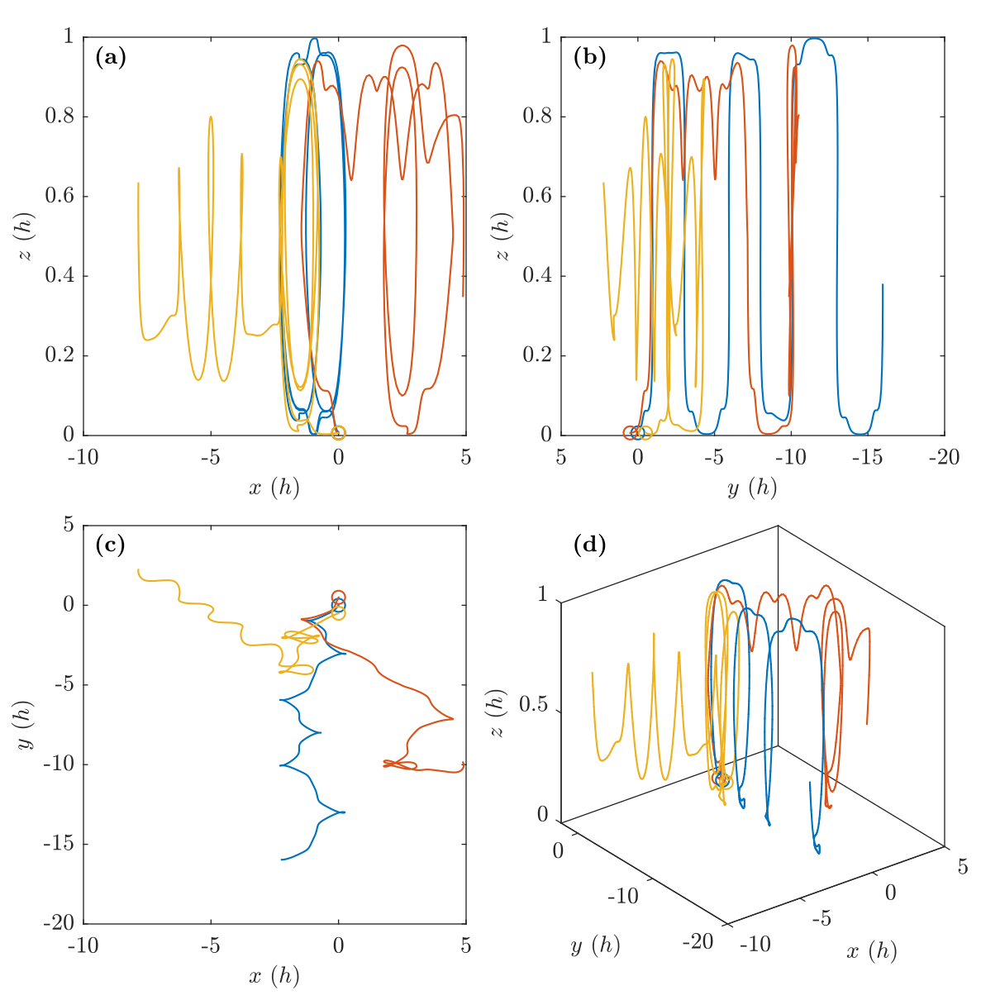

---
export_on_save:
  html: true
html:
  embed_local_images: false
  embed_svg: true
  offline: false
  toc: true
print_background: true
---

# Homework 1

- **Course:** 070601C01 大气动力学 (2024 秋)
- **Instructor:** Fang, Juan ([方娟](https://as.nju.edu.cn/54/3e/c11339a218174/page.htm))
- **Due date:** Oct. 31, 2024
- **Submit date:** Nov. 5, 2024

## Table of Contents {ignore=true}

<!-- @import "[TOC]" {cmd="toc" depthFrom=1 depthTo=6 orderedList=false} -->

<!-- code_chunk_output -->

- [Homework 1](#homework-1)
  - [Problem 1](#problem-1)
  - [Problem 2](#problem-2)
  - [Acknowledgement](#acknowledgement)
  - [Contact Information](#contact-information)
  - [Appendix](#appendix)
    - [Matlab code for Problem 2](#matlab-code-for-problem-2)

<!-- /code_chunk_output -->

## Problem 1

> &ensp; &emsp; Proof that, the vertical integrated helicity is equal to minus twice the signed area swept out by the storm relative winds between the surface and height $Z$.
>
> 

&ensp; &emsp; $\mathbb{R}^2$ 上的有向参数曲线段 ($z$ 为参数)

$$
\begin{equation*}
    \tag{1.1}
    \Gamma: \; \boldsymbol{r}(z) = \boldsymbol{V}(z), \quad z: \, 0 \to Z
\end{equation*}
$$

关于定点 $\boldsymbol{r}_0 = \boldsymbol{C}$ 所围成的**有向面积** (以逆时针为正)

$$
\begin{align*}
    S = S(\Gamma, \boldsymbol{C}) & = \boldsymbol{k} \cdot \int_{\Gamma} \frac{1}{2} \left( \boldsymbol{r} - \boldsymbol{C} \right) \times \mathrm{d} \boldsymbol{r} \\
    \tag{1.2a}
    & = \int_{0}^Z \frac{1}{2} \boldsymbol{k} \cdot \left[ \left( \boldsymbol{r} - \boldsymbol{C} \right) \times \boldsymbol{r}' \right] \mathop{\mathrm{d}z} \\
    \tag{1.2b}
    & = - \int_{0}^Z \frac{1}{2} \left( \boldsymbol{V} - \boldsymbol{C} \right) \cdot \left(\boldsymbol{k} \times \boldsymbol{V}_z \right) \mathop{\mathrm{d}z}
\end{align*}
$$

与单位气柱的**风暴相对螺旋度** (storm-relative helicity, SRH)

$$
\begin{equation*}
    \tag{1.3}
    \overline{H} := \int_0^Z \left( \boldsymbol{V} - \boldsymbol{C} \right) \cdot \left(\boldsymbol{k} \times \boldsymbol{V}_z \right) \mathop{\mathrm{d}z}
\end{equation*}
$$

满足

$$
\begin{equation*}
    \tag{1.4}
    \overline{H} = -2 S.
\end{equation*}
$$

从 (1.2a) 到 (1.2b) 是利用了向量混合积 [^1] (mixed product, *or* scalar triple product) 的轮换对称性,

[^1]: Triple Product (math24.net). <https://math24.net/triple-product.html>

$$
\begin{equation*}
    \tag{1.5}
    \begin{aligned}
        [\boldsymbol{a}, \boldsymbol{b}, \boldsymbol{c}] & := \boldsymbol{a} \cdot (\boldsymbol{b} \times \boldsymbol{c}) \\
        & = [\boldsymbol{b}, \boldsymbol{c}, \boldsymbol{a}] = [\boldsymbol{c}, \boldsymbol{a}, \boldsymbol{b}] \\
        & = - [\boldsymbol{b}, \boldsymbol{a}, \boldsymbol{c}] = - [ \boldsymbol{a}, \boldsymbol{c}, \boldsymbol{b}] = - [\boldsymbol{c}, \boldsymbol{b}, \boldsymbol{a}].
    \end{aligned}
\end{equation*}
$$

## Problem 2

> &ensp; &emsp; 扰动风速
>
> $$ \boldsymbol{V} = \nabla_{\text{H}} \frac{\partial S}{\partial z} - \kappa \boldsymbol{k} \times \nabla_{\text{H}} S + \boldsymbol{k} \kappa_{\text{H}}^2 S, $$
>
> 基本风速
>
> $$ \bar{u} = M \sin{(\kappa (z - h / 2))}, \quad \bar{v} = M \cos{(\kappa (z - h / 2))}, $$
>
> 其中
>
> $$  S = S_0 \cos{(kx)} \cos{(ly)} \sin{(mz)}, $$
>
> $$\kappa^2_{\text{H}} := k^2 + l^2, \quad \kappa^2 := \kappa^2 + m^2,$$
>
> $$ S_0 = 2.25 \, \pi^{-2} \times 10^9 \, \text{m}^3 \cdot \text{s}^{-1}, \quad M = 15 \, \text{m} \cdot \text{s}^{-1}, $$
>
> $$ \pi / k = \pi / l = \pi / m = h = 15 \, \text{km}. $$
>
> &ensp; &emsp; 1. 说明基本风矢量和水平涡度矢之间的关系, 及螺旋度的空间变化关系.
>
> &ensp; &emsp; 2. 说明全风场风矢量和涡度矢之间的关系, 及螺旋度的空间变化关系.
>
> &ensp; &emsp; 3. 在 $z = 100 \, \text{m}$ 的水平面上任意选择 5 个点作为起始点, 计算这 5 个点的空间轨迹, 并用立体图表示.
>
> &ensp; &emsp; 4. 在上述问题的基础上, 描述全风速气流运动的主要特点.

&ensp; &emsp; 我们讨论下述流场. 设置扰动流速,

$$
\begin{equation*}
    \tag{2.1a}
    \boldsymbol{V} = \nabla_{\text{H}} S_z - \kappa \boldsymbol{k} \times \nabla_{\text{H}} S + \boldsymbol{k} \kappa_{\text{H}}^2 S,
\end{equation*}
$$

基本流速,

$$
\begin{equation*}
    \tag{2.2a}
    \bar{\boldsymbol{V}} = \boldsymbol{i} M \sin{(\kappa (z - h/2))} + \boldsymbol{j} M \cos{(\kappa (z - h/2))},
\end{equation*}
$$

其中 <span style="color: blue;">(这是想建模哪个物理量?)</span>

$$
\begin{equation*}
    \tag{2.3}
    S = S_0 \cos{(kx)} \cos{(ly)} \sin{(mz)},
\end{equation*}
$$

常数

$$
\begin{equation*}
    \kappa^2_{\text{H}} := k^2 + l^2, \quad \kappa^2 := \kappa^2 + m^2,
\end{equation*}
$$

$$
\begin{equation*}
    S_0 = 2.25 \, \pi^{-2} \times 10^9 \, \text{m}^3 \cdot \text{s}^{-1}, \quad M = 15 \, \text{m} \cdot \text{s}^{-1},
\end{equation*}
$$

$$
\begin{equation*}
    \pi / k = \pi / l = \pi / m = h = 15 \, \text{km}.
\end{equation*}
$$

&ensp; &emsp; 下面考察流场的旋转特征. 把基本流速 (2.2a) 写成

$$
\begin{equation*}
    \tag{2.2b}
    \bar{\boldsymbol{V}} = M (\cos{\theta}, \sin{\theta}, 0),
\end{equation*}
$$

其中 $\theta := \pi - \kappa z$. 把扰动流速 (2.1a) 写成

$$
\begin{equation*}
    \tag{2.1b}
    \boldsymbol{V} = \kappa (S_y, -S_x, 0) + (S_{zx}, S_{yz}, \kappa^2_{\text{H}}S).
\end{equation*}
$$

从 (2.1b)(2.2b) 看出, 基本流场和扰动流场满足

$$
\begin{equation*}
    \nabla \cdot \boldsymbol{V} = \nabla \cdot \bar{\boldsymbol{V}} = 0,
\end{equation*}
$$

即是**无源场**, 从而有**向量势**. 下面说明, 基本场、扰动场和全流场的一个向量势是原场乘以 $\kappa^{-1}$. 事实上, 全风场的涡度 (旋度)

$$
\begin{equation*}
    \tag{2.4}
    \nabla \times (\bar{\boldsymbol{V}} + \boldsymbol{V})
\end{equation*}
$$

对其在 $z = z$ 平面上的算术平均值

$$
\begin{equation*}
    \tag{2.5}
    \bar{\boldsymbol{\omega}} = \nabla \times \bar{\boldsymbol{V}} = M \kappa (\cos{\theta}, \sin{\theta},0) = \kappa \bar{\boldsymbol{V}}
\end{equation*}
$$

的偏离量是

$$
\begin{equation*}
    \tag{2.6}
    \begin{aligned}
        \boldsymbol{\omega} & = \nabla \times \boldsymbol{V} \\
        & = \kappa^2 (S_y, -S_x, 0) + \kappa (S_{zx}, S_{yz}, \kappa^2_{\text{H}} S) \\
        & = \kappa \boldsymbol{V}.
    \end{aligned}
\end{equation*}
$$

所以, 基本流场 $\bar{\boldsymbol{V}}$, 扰动流场 $\boldsymbol{V}$ 和全流场 $\bar{\boldsymbol{V}} + \boldsymbol{V}$ 均是 **Beltrami 流** [^2] (速度和涡度共线且幅度呈正比的流动), $\kappa^{-1} \bar{\boldsymbol{V}}, \kappa^{-1} \boldsymbol{V}$ 和 $\kappa^{-1} (\bar{\boldsymbol{V}} + \boldsymbol{V})$ 分别是一个向量势. 全流场的螺旋度密度

$$
\begin{equation*}
    \tag{2.7}
    \begin{aligned}
        & (\bar{\boldsymbol{V}} + \boldsymbol{V}) \cdot (\nabla \times (\bar{\boldsymbol{V}} + \boldsymbol{V})) \\
        = \; & \kappa |\bar{\boldsymbol{V}} + \boldsymbol{V}|^2 \\
        = \; & \bar{h} + \kappa |\boldsymbol{V}|^2 + 2 \kappa \bar{\boldsymbol{V}} \cdot \boldsymbol{V}
    \end{aligned}
\end{equation*}
$$

正比于全流速的平方, 式中

$$
\begin{equation*}
    \tag{2.8}
    \bar{h} := \kappa |\bar{\boldsymbol{V}}|^2
\end{equation*}
$$

是基本流场的螺旋度密度, which 正比于基本流速的平方.

&ensp; &emsp; 从 (2.6) 我们猜想, 全流场的流体质点将服从右手定则螺旋式前进. 为验证猜想, 选取几个初位置, 用 Matlab 软件对全风场作数值积分得迹线 (定常流场, 迹线也是流线). <span style="color: blue;">结果表明, 有些流体质点是以左手定则螺旋式前进的, 这提示我的计算或 (和) 物理理解有误</span>. (切变涡度 dominates 曲率涡度?) 另外, 数值积分的结果依赖积分方案的选取 (not shown).

[^2]: Friedlander, S., & Lipton-Lifschitz, A. (2003). Chapter 8 - Localized Instabilities in Fluids. In S. Friedlander & D. Serre (Eds.), *Handbook of Mathematical Fluid Dynamics* (Vol. 2, pp. 289-354). North-Holland. <https://doi.org/10.1016/S1874-5792(03)80010-1>




上面两图是第一组迹线的立体图 (上上图) 和三视图 (上图), 下面两图的第二组迹线的. 图中的坐标轴已用半波长 $h$ 归一化.


&ensp; &emsp; 综上, 全流场的特点如下:

&ensp; &emsp; 1. 是定常场. 流线就是迹线.
&ensp; &emsp; 2. 是无源场. 流体不可压缩.
&ensp; &emsp; 3. 是高螺旋流 (Beltrami 流). 流管也是涡管, 相互间频繁地穿插缠绕. 流体微团以流线为瞬时转轴, 服从 **右?** 手定则 (当 $\kappa > 0$) 螺旋式前进.

## Acknowledgement

&ensp; &emsp; I am grateful to ...

## Contact Information

- **Author:** Guorui Wei (危国锐)
- **E-mail:** [313017602@qq.com](mailto:313017602@qq.com)
- **Website:** <https://github.com/grwei>

## Appendix

### Matlab code for Problem 2

```matlab {.line-numbers}
%% hw1.m
% Description: 给定速度场, 求轨迹
% Author: Guorui Wei (危国锐) (313017602@qq.com)
% Created at: Nov. 03, 2024
% Last modified: Nov. 05, 2024
%

clc; clear; close all;

if ~isfolder(".\fig\")
    mkdir(".\fig\");
end

%%

h = 15e3;
Params = [pi ./ (h * ones(1,3)), h, 2.25e9 / pi^2, 15];
flag_save = true;
fig_name = "fig_1_2_traj_1";
pos_init_list = {[0; 0; 100], [0; h/2; 100], [0; -h/2; 100]};
time_request = [0, 2.5e4];
hw1_2_unit(pos_init_list, time_request, Params, flag_save, fig_name);

flag_save = true;
fig_name = "fig_1_2_traj_2";
pos_init_list = {[0; 0; 100], [h/8; 0; 100], [-h/8; 0; 100]};
time_request = [0, 2.5e4];
hw1_2_unit(pos_init_list, time_request, Params, flag_save, fig_name);

%% function

function [] = hw1_2_unit(pos_init_list, time_request, Params, flag_save, fig_name)
    arguments
        pos_init_list = {[0; 0; 100], [7.5e3; 0; 100], [0; 7.5e3; 100], [-7.5e3; 0; 100], [0; -7.5e3; 100]};
        time_request = [0, 2e4];
        Params (1,6) = [pi ./ (15e3 * ones(1,3)), 15e3, 2.25e9 / pi^2, 15];
        flag_save = false;
        fig_name string = "fig_traj";
    end

    ode_solver = cell(size(pos_init_list));
    traj = ode_solver;
    % 求迹线 (trajectory)
    for pt_ind = 1:length(pos_init_list)
        pos_init = pos_init_list{pt_ind};
        ode_solver{pt_ind} = ode(ODEFcn=@velocity, InitialValue=pos_init, Parameters=Params, InitialTime=0);
        traj{pt_ind} = solve(ode_solver{pt_ind}, time_request(1), time_request(2));
    end

    % 绘图
    t_fig = figure(Name=fig_name);

    % set figure size
    UNIT_ORIGINAL = t_fig.Units;
    t_fig.Units = "centimeters";
    t_fig.Position = [3, 3, 16, 16];
    t_fig.Units = UNIT_ORIGINAL;

    % plot
    t_TCL = tiledlayout(t_fig, 2, 2, TileSpacing="compact", Padding="compact");

    % 主视图
    t_axes = nexttile(t_TCL, 1);
    hold(t_axes, "on");
    for pt_ind = 1:length(pos_init_list)
        plot(t_axes, traj{pt_ind}.Solution(1,:) / Params(4), traj{pt_ind}.Solution(3,:) / Params(4), '-o', LineWidth=0.8, MarkerIndices=1, ...
            DisplayName=sprintf("$[%s]$", join(string(pos_init_list{pt_ind}), ",")));
    end
    hold(t_axes, "off");
    set(t_axes, FontName="Times New Roman", FontSize=10.5, Box="on", TickLabelInterpreter="latex", ...
        Tag="(a)");
    xlabel(t_axes, "$x$ $(h)$", Interpreter="latex", FontSize=10.5);
    ylabel(t_axes, "$z$ $(h)$", Interpreter="latex", FontSize=10.5);

    % 左视图
    t_axes = nexttile(t_TCL, 2);
    hold(t_axes, "on");
    for pt_ind = 1:length(pos_init_list)
        plot(t_axes, traj{pt_ind}.Solution(2,:) / Params(4), traj{pt_ind}.Solution(3,:) / Params(4), '-o', LineWidth=0.8, MarkerIndices=1, ...
            DisplayName=sprintf("$[%s]$", join(string(pos_init_list{pt_ind}), ",")));
    end
    hold(t_axes, "off");
    set(t_axes, FontName="Times New Roman", FontSize=10.5, Box="on", TickLabelInterpreter="latex", XDir="reverse", ...
        Tag="(b)");
    xlabel(t_axes, "$y$ $(h)$", Interpreter="latex", FontSize=10.5);
    ylabel(t_axes, "$z$ $(h)$", Interpreter="latex", FontSize=10.5);

    % 俯视图
    t_axes = nexttile(t_TCL, 3);
    hold(t_axes, "on");
    for pt_ind = 1:length(pos_init_list)
        plot(t_axes, traj{pt_ind}.Solution(1,:) / Params(4), traj{pt_ind}.Solution(2,:) / Params(4), '-o', LineWidth=0.8, MarkerIndices=1, ...
            DisplayName=sprintf("$[%s]$", join(string(pos_init_list{pt_ind}), ",")));
    end
    hold(t_axes, "off");
    set(t_axes, FontName="Times New Roman", FontSize=10.5, Box="on", TickLabelInterpreter="latex", ...
        Tag="(c)");
    xlabel(t_axes, "$x$ $(h)$", Interpreter="latex", FontSize=10.5);
    ylabel(t_axes, "$y$ $(h)$", Interpreter="latex", FontSize=10.5);

    % 立体图
    t_axes = nexttile(t_TCL, 4);
    for pt_ind = 1:length(pos_init_list)
        plot3(t_axes, traj{pt_ind}.Solution(1,:) / Params(4), traj{pt_ind}.Solution(2,:) / Params(4), traj{pt_ind}.Solution(3,:) / Params(4), '-o', LineWidth=0.8, MarkerIndices=1, ...
            DisplayName=sprintf("$[%s]$", join(string(pos_init_list{pt_ind}), ",")));
        hold(t_axes, "on");
    end
    hold(t_axes, "off");
    set(t_axes, FontName="Times New Roman", FontSize=10.5, Box="on", TickLabelInterpreter="latex", ...
        Tag="(d)");
    xlabel(t_axes, "$x$ $(h)$", Interpreter="latex", FontSize=10.5);
    ylabel(t_axes, "$y$ $(h)$", Interpreter="latex", FontSize=10.5);
    zlabel(t_axes, "$z$ $(h)$", Interpreter="latex", FontSize=10.5);

    % 绘图细节
    linkaxes([nexttile(t_TCL, 1), nexttile(t_TCL, 3)], 'x');
    linkaxes([nexttile(t_TCL, 1), nexttile(t_TCL, 2)], 'y');

    t_axes_b = nexttile(t_TCL, 2);
    t_axes_c = nexttile(t_TCL, 3);
    y_lim = [t_axes_b.XLim, t_axes_c.YLim];
    y_lim = [min(y_lim), max(y_lim)];
    t_axes_b.XLim = y_lim;
    t_axes_c.YLim = y_lim;

    for t_axes = findobj(t_TCL, 'Type', "Axes", {'-regexp', 'Tag', "^\([a-z]+\)"}).'
        t_txt_box = annotation(t_fig, "textbox", String="\bf " + t_axes.Tag, Position=[t_axes.Position([1, 2]) + [0, t_axes.Position(4)], .1, .1], FontSize=10.5, Interpreter="latex", LineStyle="none", HorizontalAlignment="left", VerticalAlignment="top");
        UNIT_ORIGINAL = t_txt_box.Units;
        t_txt_box.Units = "points";
        t_txt_box.Position = [t_txt_box.Position([1,2]) - [0, 10.5*1.5], 10.5*10, 10.5*1.5];
        t_txt_box.Units = UNIT_ORIGINAL;
    end

    if flag_save
        print(t_fig, ".\fig\" + t_fig.Name + ".svg", "-vector", "-dsvg")
    end

    %%% 立体图

    t_fig = figure(Name=fig_name+"_3D");

    % set figure size
    UNIT_ORIGINAL = t_fig.Units;
    t_fig.Units = "centimeters";
    t_fig.Position = [3, 3, 16, 16];
    t_fig.Units = UNIT_ORIGINAL;

    % plot
    t_TCL = tiledlayout(t_fig, 1, 1, TileSpacing="compact", Padding="compact");
    title(t_TCL,{"$r'(r, t) = M (\sin{\varphi}, \cos{\varphi}, 0) + \nabla_{\mathrm{H}} S_z - e_3 \times \kappa \nabla_{\mathrm{H}} S + e_3 \kappa_{\mathrm{H}}^2 S, \quad$ " + compose("$t:$ %.2g $\\to$ %.2e", time_request); "$r := (x, y, z), \; \varphi := \kappa (z - h / 2), \; S = S_0 \cos{(kx)} \cos{(ly)} \sin{(mz)}$"}, FontSize=10.5, Interpreter="latex");
    t_axes = nexttile(t_TCL, 1);
    for pt_ind = 1:length(pos_init_list)
        plot3(t_axes, traj{pt_ind}.Solution(1,:) / Params(4), traj{pt_ind}.Solution(2,:) / Params(4), traj{pt_ind}.Solution(3,:) / Params(4), '-o', LineWidth=0.8, MarkerIndices=1, ...
            DisplayName=compose("(%s) [%.3g, %.3g, %.2e]", ode_solver{pt_ind}.SelectedSolver, pos_init_list{pt_ind}.' / Params(4)));
        hold(t_axes, "on");
    end
    hold(t_axes, "off");
    set(t_axes, FontName="Times New Roman", FontSize=10.5, Box="on", TickLabelInterpreter="latex", ...
        Tag="(d)");
    xlabel(t_axes, "$x$ $(h)$", Interpreter="latex", FontSize=10.5);
    ylabel(t_axes, "$y$ $(h)$", Interpreter="latex", FontSize=10.5);
    zlabel(t_axes, "$z$ $(h)$", Interpreter="latex", FontSize=10.5);

    legend(t_axes, Location="northwest", Interpreter="latex", FontSize=10.5, Box="off", NumColumns=1);
    % lgd.Layout.Tile = "east";

    if flag_save
        print(t_fig, ".\fig\" + t_fig.Name + ".svg", "-vector", "-dsvg")
    end
end

function drdt = velocity(t, r, P)
arguments
    t = 0;
    r (3,1) = [0; 0; 0]
    P (1,6) = [pi ./ (15e3 * ones(1,3)), 15e3, 2.25e9 / pi^2, 15];
end
    wave_vec = P(1:3);
    h = P(4);
    S_0 = P(5);
    M = P(6);

    kappa_H = sqrt(sum(wave_vec(1:2).^2));
    kappa = sqrt(sum(wave_vec.^2));

    S = @(r) S_0 * cos(wave_vec(1)*r(1)) * cos(wave_vec(2)*r(2)) * sin(wave_vec(3)*r(3));
    S_z = @(r) S_0 * (+ wave_vec(3)) * cos(wave_vec(1)*r(1)) * cos(wave_vec(2)*r(2)) * cos(wave_vec(3)*r(3));
    S_x = @(r) S_0 * (- wave_vec(1)) * sin(wave_vec(1)*r(1)) * cos(wave_vec(2)*r(2)) * sin(wave_vec(3)*r(3));
    S_y = @(r) S_0 * (- wave_vec(2)) * cos(wave_vec(1)*r(1)) * sin(wave_vec(2)*r(2)) * sin(wave_vec(3)*r(3));
    S_zx = @(r) S_0 * (- wave_vec(1) * wave_vec(3)) * sin(wave_vec(1)*r(1)) * cos(wave_vec(2)*r(2)) * cos(wave_vec(3)*r(3));
    S_zy = @(r) S_0 * (- wave_vec(2) * wave_vec(3)) * cos(wave_vec(1)*r(1)) * sin(wave_vec(2)*r(2)) * cos(wave_vec(3)*r(3));

    drdt = zeros(3,1);

    drdt(1) = M*sin(kappa * (r(3) - h/2)) + kappa * S_y(r) + S_zx(r);
    drdt(2) = M*cos(kappa * (r(3) - h/2)) - kappa * S_x(r) + S_zy(r);
    drdt(3) = kappa_H^2 * S(r);
end
```
